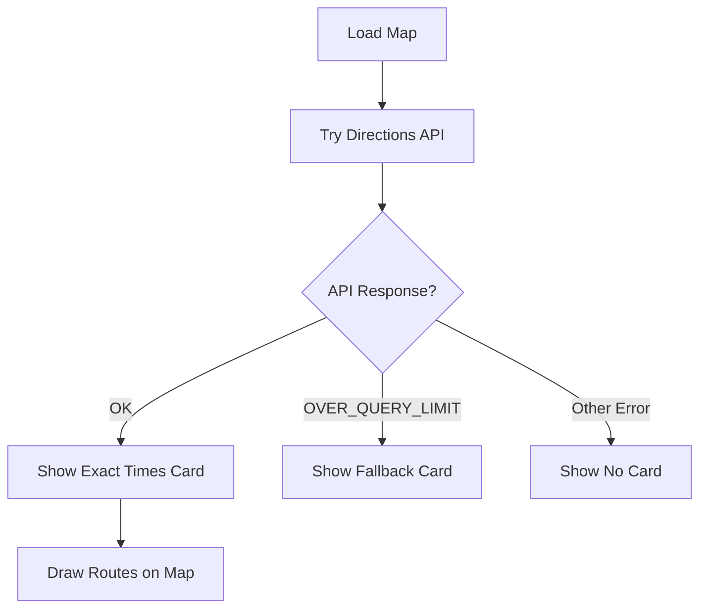

# Travel Times Fallback System

## Overview

The `AppointmentMapSection` component now includes a sophisticated fallback system for calculating travel times when the Google Maps Directions API quota has been exceeded.

## Implementation Strategy

### 🎯 Primary Method: Directions API (Default)
- **Priority**: Always tries Directions API FIRST
- **When it works**: Shows exact routes, distances, and travel times from Google
- **Route visualization**: Draws polylines on map
- **Data format**: Real times from traffic data (e.g., "15 mins (3.2 km)")

### ⚠️ Fallback Method: Haversine Formula (Only on Quota Error)
- **When it activates**: ONLY when API returns `OVER_QUERY_LIMIT` or `REQUEST_DENIED`
- **How it works**: Uses Haversine formula to calculate great-circle distance
- **Visual distinction**: Yellow border card with warning icon
- **Data format**: Approximations with `~` prefix (e.g., "~15 mins (~3.2 km en línea recta)")

## New Logic Flow (API First)



## Technical Details

### Error Detection in calculateRoutes

```typescript
directionsService.route(request, (result: any, status: any) => {
  if (status === 'OK' && result?.routes?.[0]) {
    // ✅ SUCCESS: Use real API data
    setTravelTimesData(timesData)
    setMapError(null)
  } else if (status === 'OVER_QUERY_LIMIT' || status === 'REQUEST_DENIED') {
    // ⚠️ QUOTA ERROR: Activate fallback
    console.warn('🚫 Directions API quota exceeded:', status)
    setMapError('quota-exceeded')
    setTravelTimesData([])
  } else {
    // Other errors (ZERO_RESULTS, NOT_FOUND, etc.)
    console.warn('Could not calculate route:', status)
    setMapError('route-error')
    setTravelTimesData([])
  }
})
```

### Haversine Distance Calculation

```typescript
const calculateDistance = (lat1: number, lon1: number, lat2: number, lon2: number): number => {
  const R = 6371 // Radio de la Tierra en km
  const dLat = (lat2 - lat1) * (Math.PI / 180)
  const dLon = (lon2 - lon1) * (Math.PI / 180)
  const a =
    Math.sin(dLat / 2) * Math.sin(dLat / 2) +
    Math.cos(lat1 * (Math.PI / 180)) *
      Math.cos(lat2 * (Math.PI / 180)) *
      Math.sin(dLon / 2) *
      Math.sin(dLon / 2)
  const c = 2 * Math.atan2(Math.sqrt(a), Math.sqrt(1 - a))
  return R * c // Distancia en km
}
```

### Time Estimation

```typescript
const estimateTime = (distanceKm: number): string => {
  const hours = distanceKm / 30 // Asumiendo 30 km/h en tráfico urbano
  const minutes = Math.round(hours * 60)
  if (minutes < 60) {
    return `~${minutes} mins`
  } else {
    const h = Math.floor(minutes / 60)
    const m = minutes % 60
    return `~${h}h ${m}m`
  }
}
```

**Assumptions**:
- Average urban traffic speed: 30 km/h
- Takes into account typical city conditions

## UI Differences

### Normal Card (Directions API) ✅
- Clean white background
- Exact times and distances from Google
- Routes drawn on map
- Format: "15 mins (3.2 km)"
- Shows when: `mapError !== 'quota-exceeded'` AND `travelTimesData.length > 0`

### Fallback Card (Haversine) ⚠️
- Yellow warning border (`border-2 border-yellow-200`)
- Warning icon (⚠️)
- Approximate times with `~` prefix
- Distance labeled "en línea recta"
- Format: "~15 mins (~3.2 km en línea recta)"
- Informational tip at bottom
- Shows when: `mapError === 'quota-exceeded'`

## Rendering Logic (Updated)

```typescript
// Show normal card if API returned data (and no quota error)
{travelTimesData.length > 0 && 
 travelTimesData.some(...) && 
 mapError !== 'quota-exceeded' && (
  <div className="bg-white rounded-xl p-6">
    {/* Exact data from Directions API */}
  </div>
)}

// Show fallback ONLY when quota exceeded
{mapError === 'quota-exceeded' && 
 appointmentsWithDetails.length > 0 && 
 userLocation && (
  <div className="bg-white rounded-xl p-6 border-2 border-yellow-200">
    {/* Approximations using Haversine */}
  </div>
)}
```

## Benefits

1. **Best experience by default**: Users see exact data when quota available
2. **Specific error handling**: Only falls back on actual quota errors
3. **Clear communication**: Yellow card clearly indicates approximate data
4. **Progressive enhancement**: Uses best available data source
5. **No unnecessary fallbacks**: Doesn't show approximations when API works

## Limitations of Fallback

- **Straight-line distance**: Doesn't account for roads, obstacles, or traffic
- **Fixed speed assumption**: 30 km/h may not match actual conditions
- **No route visualization**: Map shows markers only, no polyline
- **Less accurate**: Should be used for rough planning only

## User Communication

The fallback card includes:
- ⚠️ Warning icon
- "Estimados" label in title
- Explanatory text: "Calculados en línea recta. Los tiempos reales pueden variar según el tráfico y las rutas."
- Tip: "💡 Para ver rutas y tiempos exactos, configura una API key de Google Maps con cuota disponible."

## Testing Scenarios

1. **✅ Normal operation**: API returns OK → shows exact data with routes
2. **⚠️ Quota exceeded**: API returns OVER_QUERY_LIMIT → shows yellow fallback card
3. **❌ Other API errors**: ZERO_RESULTS, NOT_FOUND → no card shown
4. **📍 No user location**: Geolocation denied → map shows appointments only
5. **📭 No appointments**: Empty list → no travel time card

## Key Differences from Previous Version

| Aspect | Before | Now |
|--------|--------|-----|
| **When fallback shows** | When `travelTimesData.length === 0` | When `mapError === 'quota-exceeded'` |
| **Error detection** | Generic failure | Specific quota error check |
| **Default behavior** | Could show fallback unnecessarily | Always tries API first |
| **User experience** | Might see approximations when API works | Only sees approximations on quota error |
